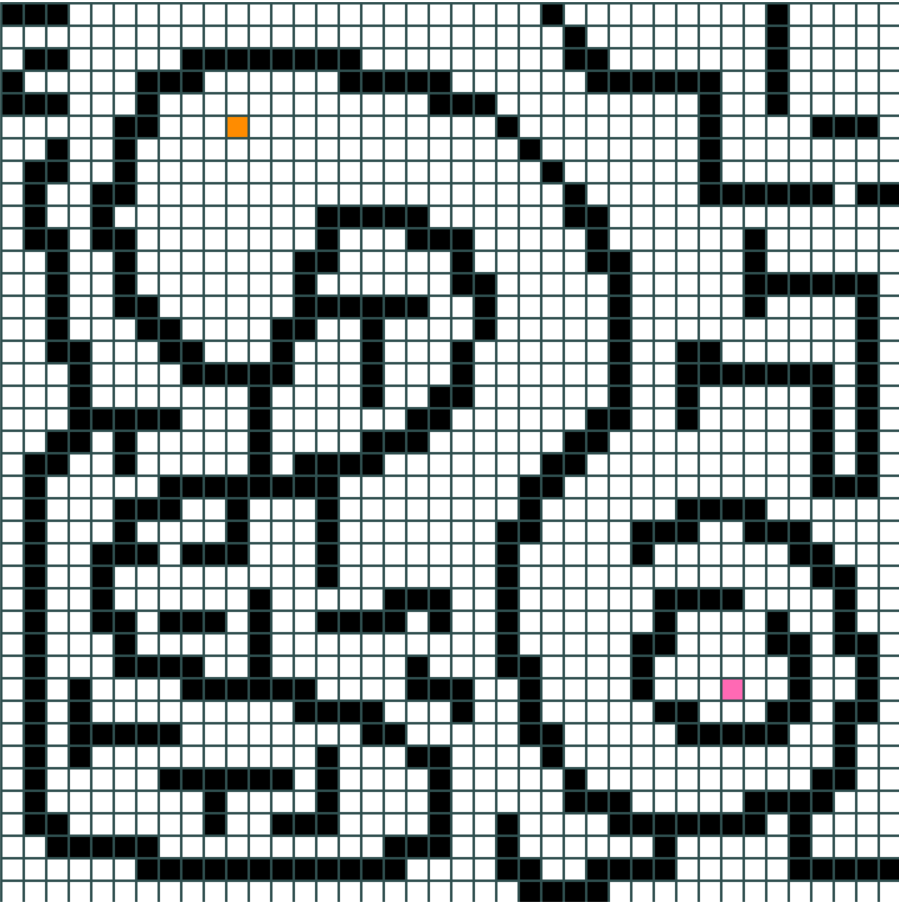
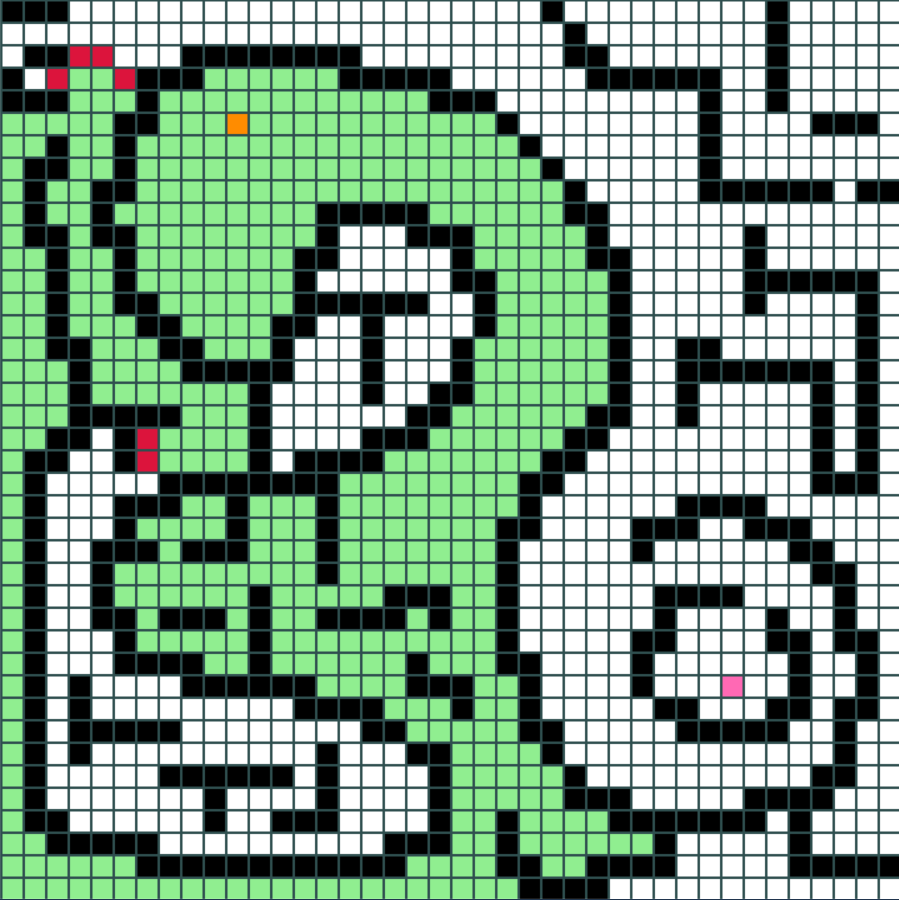
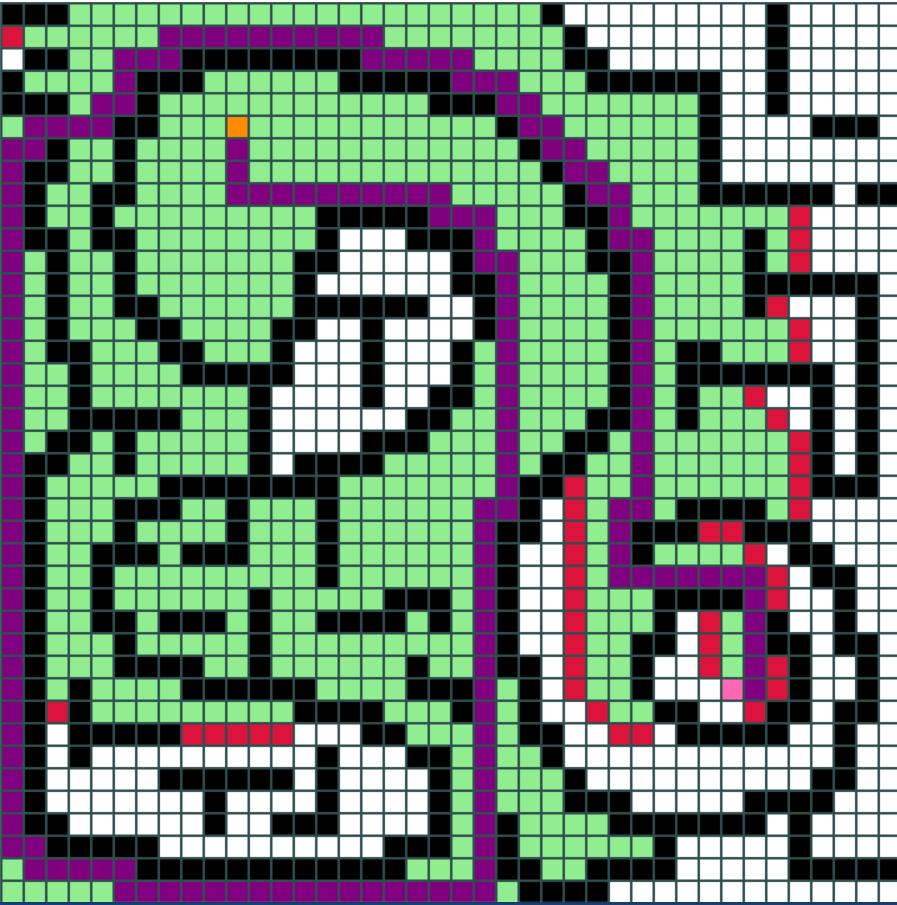

# A* SEARCH ALGORITHM
A* is an *informed search algorithm* that is formulated in terms of weighted graphs. Starting from a specific starting node of a graph, it aims to find a path to the given goal node having the smallest cost (least distance travelled, shortest time, etc.). It does this by maintaining a tree of paths originating at the start node and extending those paths one edge at a time until its termination criterion is satisfied. The project aims at visualizing the a-star path finding algorithm. It starts with the user choosing the starting and the ending nodes on a 40x40 grid and drawing a maze on the same to challenge the algorithm. Though the graphical user interface is built almost entirely on pygame, the most important module on which the algorithm stands is *queue* which enables instantiating a priority queue. **Refer to the main function of the code to learn about the control keys.**

&nbsp;&nbsp;&nbsp;&nbsp;&nbsp;&nbsp;&nbsp;&nbsp;&nbsp;&nbsp;&nbsp;&nbsp;&nbsp;&nbsp;&nbsp;&nbsp;&nbsp;&nbsp;&nbsp;&nbsp;&nbsp;&nbsp;&nbsp;&nbsp;
